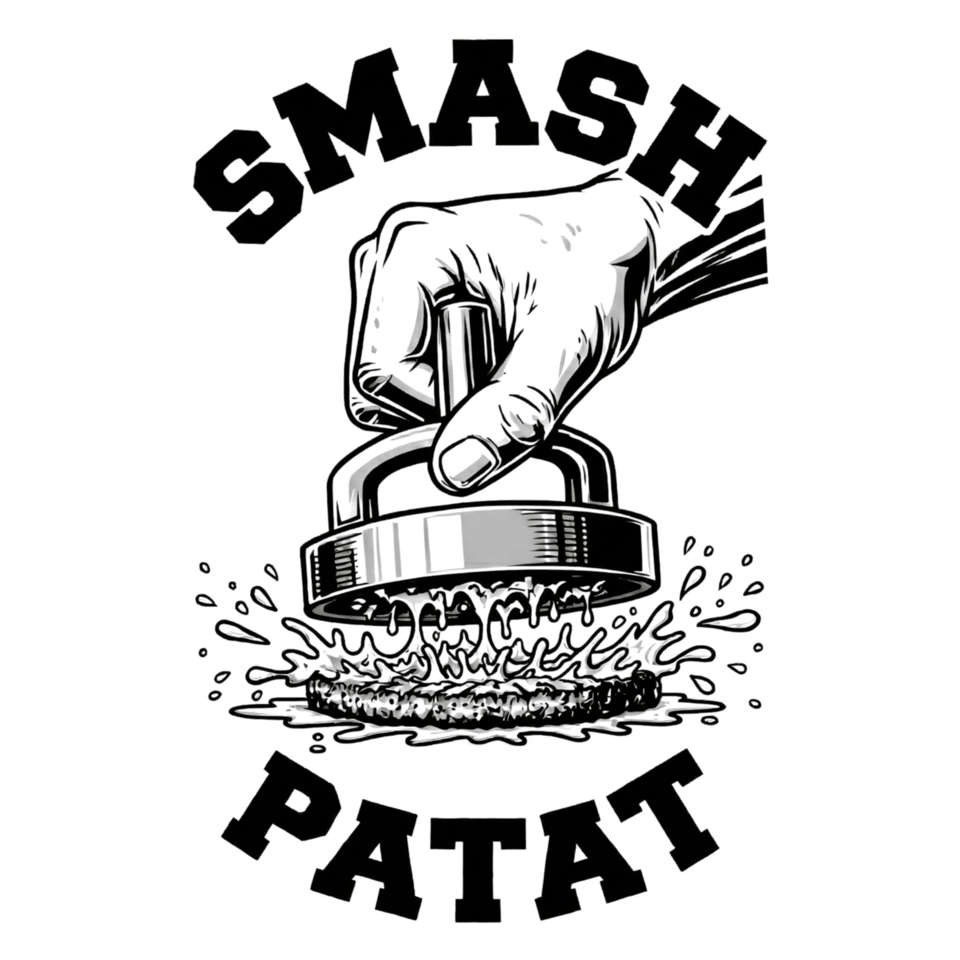
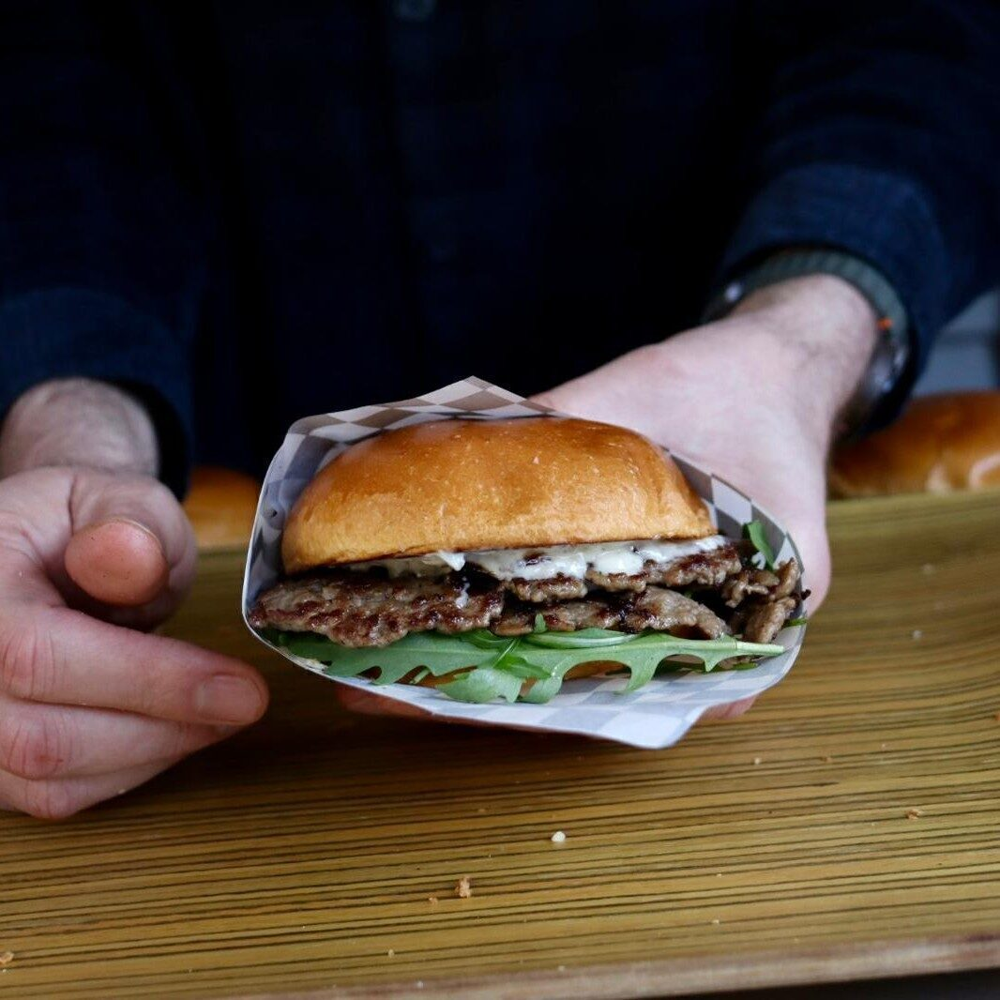

# 🍔 Smash Patat – Website Documentatie

**Live website:** https://smashpatat.be

---

## 📁 Bestandsstructuur

```
smashpatat.github.io/
├── index.html                        → De volledige hoofdpagina
├── reservering.html                  → Boekingsformulier + agenda
├── allergenen.html                   → Allergeneninformatie
├── privacy.html                      → Privacybeleid (GDPR-verplicht)
├── menu.json                         → Menu database (burgers, dranken, extra's)
├── photos.json                       → Automatisch gegenereerde fotolijst (niet handmatig aanpassen!)
├── logo.png                          → Zwart/wit logo (witte achtergrond) + favicon
├── logo_no_txt.png                   → Logo zonder tekst
├── logo_special.png                  → Foto voor de specials burgers
├── classic-smash.png / cheese-smash.png / kids-smash.png / oklahoma.jpg
│                                     → Foto's van de menukaart
├── checker.png / insta.png           → Tegelpatroon en icoon (worden nooit herschaald)
├── over_ons.jpg / over_ons_night.jpg → Foto's bij "Over ons"
├── fotos/                            → Map met alle sfeerfoto's voor de fotoband
│   ├── sfeer_burger_1.jpg
│   ├── sfeer_burger_2.jpg
│   └── ...
├── sitemap.xml / robots.txt / BingSiteAuth.xml
├── .github/
│   └── workflows/
│       └── update-photos.yml         → GitHub Action: optimaliseert beelden + genereert photos.json
└── README.md                         → Deze documentatie
```

---

## ✏️ Iets aanpassen op de website

1. Ga naar **github.com/vermope/smashpatat.github.io**
2. Klik op het bestand dat je wil aanpassen (`index.html`, `privacy.html` of `menu.json`)
3. Klik op het **potloodje** (rechtsboven in het bestand)
4. Maak je wijziging
5. Klik op **"Commit changes"**
6. Wacht 1-2 minuten → de website is automatisch bijgewerkt

---

## ⚠️ Belangrijk: altijd relatieve paden

Verwijs **nooit** naar `https://vermope.github.io/smashpatat.github.io/...`. Dat pad bestaat niet meer sinds de site op `smashpatat.be` draait — afbeeldingen laden dan niet (het logo op de privacy-pagina viel hierdoor weg).

Schrijf altijd het pad zonder domein:

```html


```

`index.html` vangt oude absolute URL's uit `menu.json` en `photos.json` nog automatisch op, maar nieuwe verwijzingen doe je relatief.

---

## 🖼️ Sfeerfoto's beheren (fotoband "Smash Patat in Beeld")

De fotoband laadt automatisch alle foto's uit de `fotos/` map. Je hoeft nooit code aan te passen.

### Foto's toevoegen:

1. Ga naar je repo op GitHub
2. Klik op de map **`fotos/`**
3. Klik **"Add file"** → **"Upload files"**
4. Sleep je foto's erin (JPG, PNG of WEBP)
5. Klik **"Commit changes"**

✅ GitHub start automatisch een actie die de foto's optimaliseert en `photos.json` hergenereert.
Na ongeveer 1-2 minuten verschijnen de nieuwe foto's op de website.

### Foto's verwijderen:

1. Ga naar de `fotos/` map op GitHub
2. Klik op de foto die je wil verwijderen
3. Klik het **prullenbak-icoontje** rechtsboven
4. Commit — `photos.json` wordt automatisch bijgewerkt

### Volgorde:

De volgorde wordt **bij elk paginabezoek willekeurig geschud**. Bestandsnamen bepalen dus niets — elke bezoeker ziet een andere verdeling over de twee rijen.

### Layout van de band:

- **Desktop:** twee rijen die tegen elkaar in schuiven (bovenste naar links, onderste naar rechts). Zet je de cursor op de band, dan pauzeert hij.
- **Mobiel:** één veegbare strip, één foto per veeg (snap).
- **Klikken** op een foto opent hem groot in een lightbox (sluiten met × of Escape).
- Bezoekers met "verminderde beweging" aan in hun systeeminstellingen krijgen een stilstaande, scrollbare band.

### Problemen?

- **Foto's verschijnen niet?** Wacht 1-2 minuten en ververs de pagina (Ctrl+F5)
- **GitHub Action mislukt?** Ga naar het tabblad "Actions" in je repo voor details
- **Oude foto's nog zichtbaar?** Browser cache — open in incognito venster
- **Foto ligt op zijn kant?** Zie hieronder bij de Action

---

## ⚙️ De GitHub Action: `update-photos.yml`

Draait automatisch bij elke push naar `fotos/**` of naar een afbeelding in de root, en handmatig via **Actions → Run workflow**.

Wat hij doet:

1. **Sfeerfoto's** (`fotos/`): rechtzetten volgens EXIF (`-auto-orient`), verkleinen naar max 1600px, EXIF strippen, JPEG progressive op kwaliteit 82.
2. **Beelden in de root** (logo, menufoto's): max 960px — dubbel wat de site toont, dus scherp op retina. PNG's door pngquant (80–96%). `checker.png` en `insta.png` worden overgeslagen, net als alles onder 150KB.
3. **`photos.json`** genereren met relatieve paden (`fotos/naam.jpg`).
4. Alles terugcommitten.

⚠️ De Action **herschrijft je originelen in de repo**. Bewaar de camerabestanden dus ergens buiten de repo.

⚠️ Vereist **Settings → Actions → General → Workflow permissions → Read and write permissions**, anders kan de Action niet terugcommitten.

**Foto op zijn kant?** Dat komt van EXIF-rotatie die verloren ging. Sinds `-auto-orient` in de Action zit, gebeurt dat niet meer bij nieuwe uploads. Een foto die al fout in de repo staat, moet je zelf gedraaid opnieuw uploaden.

---

## 🍔 Menu aanpassen

Het menu wordt automatisch geladen uit `menu.json`.

### Menu bewerken:

1. Open `menu.json` op GitHub
2. Pas de gewenste items aan
3. Commit de wijzigingen
4. De website laadt automatisch de nieuwe data

### Structuur van een menu-item:

```json
{
  "id": "classic",
  "name": "Smash Patat Classic",
  "description": "Dubbel premium beef patty, SP burger saus, sla, tomaat, ui, pickle",
  "price": 9.50,
  "tag": "Bestseller",
  "image": "classic-smash.png"
}
```

### Tags:

- **Bestseller tag:** `"tag": "Bestseller"`
- **Special tag:** `"tag": "Special"` (wit kader met ★, aparte sectie bovenaan menu)
- **Geen tag:** `"tag": null`

### Huidig menu:

| Burger | Prijs |
|--------|-------|
| Kids Smash Patat 🎈 | €6,50 |
| Smash Patat Classic ★ Bestseller | €9,50 |
| Smash Patat Double Cheese | €9,50 |
| Gorgo Smash ★ Special | €11,00 |
| Chili Smash 🌶️🌶️ ★ Special | €11,00 |
| Truffel Smash ★ Special | €11,50 |

**Dranken:** Fris/Pils (€2,80), Speciaal Bier (€3,50)

**Extra toppings:** Pancetta (€1), Extra Patty (€2,50), Cheddar (€1), Jalapeño Infused Hot Honey (€1), Oklahoma Stijl (€1,50), Jalapeño Mix (€1), Pickled Onion (€0,50), Ajuin Peer Confijt (€1), Bourbon Bacon Jam (€1), Zesty Gorgo Saus (€1), SP Chili Saus (€0,50), SP Burger Saus (€0,50), SP Truffelsaus (€0,75), Rucola (€0,50), Parmigiano (€0,50), Balsamico Glaze (€0,50)

---

## 📅 Locaties & Agenda (automatisch via Google Agenda)

Evenementen op de website worden automatisch opgehaald uit Google Agenda.

### Een nieuw evenement toevoegen:

1. Open **Google Agenda** op smashpatat@gmail.com
2. Voeg een nieuw event toe met **naam, datum, tijd en locatie**
3. De website toont het event automatisch — geen aanpassing nodig!

Staan er geen events in de agenda, dan toont de site: *"Geen aankomende publieke evenementen gepland."*

*Alleen jij kan de agenda bewerken — bezoekers kunnen enkel lezen.*

### Technische details:

- **Script URL:** `https://script.google.com/macros/s/AKfycbzcmNvWJE-kzNoYDrvGPgRWTe3XNtyaWNenhKjtkaCbZVaV17nHjsJjRF5H3WjahbJWWQ/exec`
- **Script beheren:** script.google.com → inloggen met smashpatat@gmail.com → project **"SmashPatatCalendarSyncAPI"**
- Het script leest de komende **6 maanden** aan events uit
- Als het script stopt met werken: ga naar Apps Script → **Implementeren** → **Nieuwe implementatie** → opnieuw deployen als **Webtoepassing**

---

## 🖼️ Logo of vaste afbeeldingen vervangen

1. Upload het nieuwe bestand op GitHub via **"Add file → Upload files"**
2. Gebruik **exact dezelfde bestandsnaam** (bv. `logo.png`)
3. GitHub overschrijft het oude bestand automatisch

⚠️ **GitHub is hoofdlettergevoelig:** `Logo.png` ≠ `logo.png`

Het logo wordt ook gebruikt als **favicon** (icoontje in het browsertabblad). Bij het vervangen van `logo.png` wordt het favicon automatisch ook bijgewerkt.

---

## 🐛 Afbeeldingen die niet laden

Twee oorzaken die we al zijn tegengekomen:

1. **Absolute URL's** naar `vermope.github.io/smashpatat.github.io/` — zie "altijd relatieve paden" hierboven.
2. **Firefox en `loading="lazy"`.** Firefox laadt lazy-afbeeldingen die via JavaScript worden toegevoegd vaak niet. De fotoband en de menukaarten gebruiken daarom een eigen loader (`data-src` + IntersectionObserver, met een vangnet na 3 seconden). Voeg bij nieuwe, door JavaScript gegenereerde afbeeldingen dus **geen** `loading="lazy"` toe, maar gebruik `data-src` en roep `hydrateLazyImages(container)` aan.

---

## 🎨 Kleuren & stijl

| Element | Waarde |
|---------|--------|
| Achtergrond | `#111111` |
| Hero achtergrond | `#ffffff` |
| Wit | `#f5f5f0` |
| Rood accent | `#D72B2B` |
| Font titels | **Alfa Slab One** (Google Fonts) |
| Font tekst | **Inter** (Google Fonts) |

---

## 📬 Contact & socials aanpassen

Zoek in `index.html` naar de sectie met `id="contact"` en pas de links aan:

```html
✉ smashpatat@gmail.com
📷 Instagram
👍 Facebook
```

---

## 🔒 Privacybeleid

De website bevat een aparte `privacy.html` pagina, verplicht onder de GDPR/AVG. De footer linkt automatisch naar deze pagina.

Bij wijzigingen in hoe je gegevens verwerkt, pas dan ook `privacy.html` bij en update de datum **"Laatst bijgewerkt"** bovenaan.

De toezichthouder in België is de **Gegevensbeschermingsautoriteit (GBA):** gegevensbeschermingsautoriteit.be

---

## 🚀 Hosting

De website wordt **gratis gehost** via **GitHub Pages**, op het eigen domein `smashpatat.be`. Elke wijziging is na **1-2 minuten** live.

---

*Gemaakt met ❤️ voor Smash Patat*
